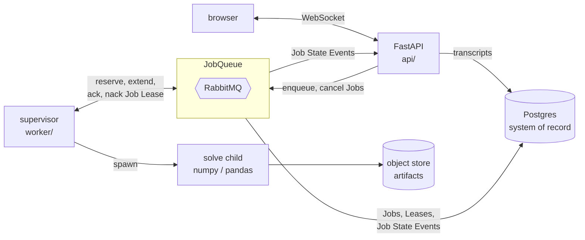

# abacus

Chat-driven portfolio analytics. You paste a portfolio, ask a question in English, and get back
computed analytics with charts — backtests, Monte Carlo simulations, correlation and drawdown.

## Architecture

A **durable handoff between a websocket and a pool of workers.** Postgres is the system of
record for both chat transcripts and job state. The broker distributes jobs.

The LLM turns user input from natural language into an `AnalysisRequest`, decides which analysis
answers the question, and explains the result afterward. A job broker hands the work to a stateless
worker container, which runs a CPU-bound computational task and
writes artifacts to object storage.



## Status

**Phase 3 — containerized workers.** Designed ahead of the code in
[`docs/worker.md`](docs/worker.md). Landed so far: the object store behind a Protocol, the
`spawn`ed solve child, the supervisor that holds one lease against one child — reserve, extend on a
timer, write the artifact, then `ack` — and every job transition as a numbered row a reconnecting
client replays. `docker compose up -d --scale worker=2` runs two of them. Still to come: the
`chat.events` fan-out that delivers those transitions live, `cancel`, and the acceptance script that
kills a worker mid-solve. No agent and no frontend yet.

Roadmap: `1` chat over WebSocket → `2` the job broker on RabbitMQ → **`3` containerized workers** →
`4` the analytics engine → `5` chat UI → `6` cloud.

[`docs/roadmap.md`](docs/roadmap.md) gives each phase what it lands, how it is accepted, and the
decision it forces. Phase 1's transport is designed ahead of the code in
[`docs/websocket.md`](docs/websocket.md) — frame protocol, resume, fan-out across replicas, and
drain-on-deploy, through phase 6.

## Layout

```
api/         FastAPI routes and Dependency Injection wiring.
core/        Domain: Config, frame models, connection transport,
             chat protocol handler, JobQueue Protocol, sessions, jobs.
adapters/    Infrastructure behind interfaces: postgres, broker, object store.
docs/        Design notes.
dev/         Local tooling.
worker/      Job consumer + solver runner. (phase 3)
gateway/     LLM gateway. (phase 4)
infra/       K8s manifests. (phase 6)
```

## Quick start

```bash
make up          # build + start api, postgres, rabbitmq
curl localhost:8000/livez      # {"status":"ok"}
curl localhost:8000/readyz     # {"status":"ready", ...}
make chat        # serve dev/chat.html on :8080 (needs the api up)
make verify      # Phase 0 acceptance checks
make down        # stop, keeping the database
make reset       # stop and destroy the database
```

Local test run needs no containers. Requires [uv](https://docs.astral.sh/uv/)
(`brew install uv`); it downloads its own CPython 3.12, so no system Python is involved:

```bash
make install     # .venv from uv.lock, exactly
make test
make lint
```

Adding or bumping a dependency means editing `pyproject.toml` and running `make lock`.

RabbitMQ management UI: http://localhost:15672 (`abacus` / `abacus`).

MinIO console: http://localhost:9001 (`abacus` / `abacus-local-secret`). The artifact bucket is
created on first use by `S3ObjectStore.ensure_bucket`, not by compose.

`make chat` serves `dev/chat.html`, a browser client for `/ws/chat/{session_id}` — raw frames in
one pane, the assembled transcript in the other. Each button at the bottom sends a deliberately bad
frame (or opens a deliberately bad socket) and logs what the server sends back, eg. buttons for
connection cap, bad session id, invalid json, etc. It is a test harness, not the phase-5 UI.

## License

MIT — see [LICENSE](LICENSE). Market data belongs to its respective providers.
