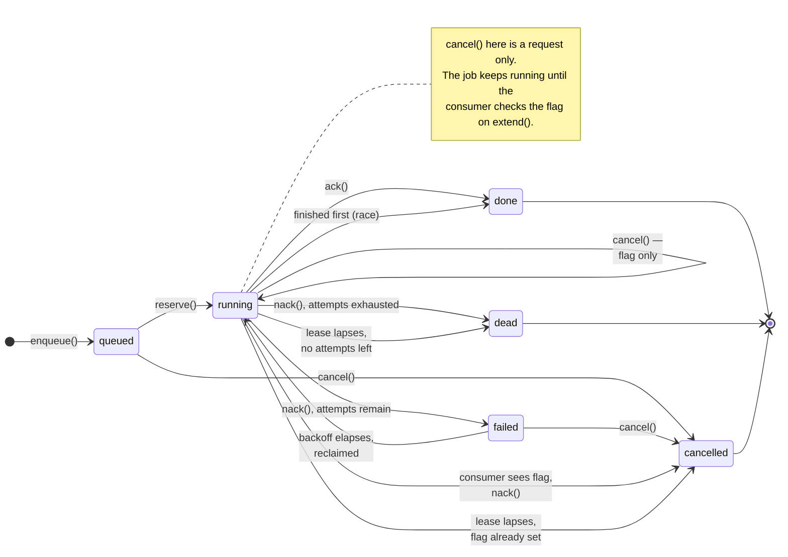

# Phase 2 — the job broker on RabbitMQ

Design-first for the same reason [`websocket.md`](websocket.md) was: the contract and the semantics
are settled here before the implementation, so that what got built can be checked against what was
argued rather than the other way round.

**A note on what this document was, and is.** It was written as a *comparison* — two
implementations, Postgres and RabbitMQ, and a benchmark to decide between them. That is not what
this repo is for. Abacus exists to learn two things: how RabbitMQ and distributed messaging behave
in the context of a job scheduler, and (from phase 4) AI integration. A
`SELECT … FOR UPDATE SKIP LOCKED` queue teaches neither — it is the *absence* of a broker, which is
the thing under study. So there is no `PostgresJobQueue` and no `docs/benchmark.md`, and this is not
a deferral: a backend bake-off is a different project.

What survives is the reasoning, which is worth more here than the measurement would have been. The
phase's question, in one line: **when is a database a sufficient queue, and when is it not?** The
received answer — "never use your database as a queue" — is repeated far more often than it is
measured. `SELECT … FOR UPDATE SKIP LOCKED` is genuinely good and buys transactional enqueue with
the job's own state. RabbitMQ buys real delivery semantics and does not spend connection-pool slots.
Jobs here run 30 seconds to five minutes at a low rate, which is precisely the regime where the
folklore is least likely to apply.

That question turned out to be answerable from the build. Every place below that says "and this is
what the split costs" is a claim the RabbitMQ implementation had to make good on in code, and the
bill arrived in a legible form: `_maintain`'s two periodic Postgres queries exist *only* because the
broker cannot answer what a row can. It has no per-message deadline, so a lapsed lease has to be
polled for; it cannot enlist in a transaction, so a dual write has to be swept for. Sections marked
**[not built]** are the parts of the original comparison that were specified and then deliberately
not carried out; they are kept because the reasoning in them is the finding.

**One Protocol, one suite run twice** remains the deliverable, and is met: `MemoryJobQueue` and the
RabbitMQ adapter both pass `tests/test_job_queue.py` unmodified, 35 tests apiece. A Protocol nobody
has implemented twice is a guess, and the second implementation being a fake does not weaken that —
the fake is the reference semantics, and it is the one that has to be argued with.

## What a queue is here: pull, with a lease

The shape is not an implementation detail; it is the thing being built. A consumer **asks** for work,
holds it under a **lease** with a deadline, **extends** the lease while it is still working, and
**acknowledges** or **releases** at the end. Leases, visibility timeouts, competing consumers,
backpressure — that vocabulary is the phase.

```
reserve()  ──▶  job, leased until T
                  │  worker solves (30s … 5min)
                  ├── extend()   … pushes T out, repeatedly
                  ├── ack()      … terminal success, the job is gone from the queue
                  └── nack()     … terminal failure or a voluntary release
                  ✗  crash       … lease expires at T, job returns to the queue
```

Nothing about that requires polling *as an interface*. `reserve(wait_for=…)` is allowed to block, and
each implementation decides how it waits — which is one of the things worth measuring, not
specifying.

**Why pull and not push.** RabbitMQ's native shape is push: the broker hands deliveries to a consumer
up to its prefetch window. Postgres' native shape is pull. A pull-shaped Protocol is implementable on
both — the RabbitMQ adapter runs a background consumer at `prefetch_count=1` and feeds an internal
`asyncio.Queue` that `reserve()` reads — whereas a push-shaped Protocol forces the Postgres adapter to
invent a dispatcher loop and hide it behind a callback, which is the same polling with less of it
visible. Pull also keeps the interesting property explicit: **a worker takes work only when it has
capacity**, which is what makes backpressure a consequence of the design rather than a feature bolted
onto it.

`prefetch_count=1` is not incidental. With a larger window RabbitMQ hands a consumer several
five-minute jobs at once; they sit in that consumer's buffer while other consumers idle, and if it
dies they all wait for the channel to close. One in flight per consumer is what makes the two
implementations comparable at all.

## The job's life, and what cancel does to it

Six states, and the only two that are easy to confuse are `failed` and `dead`. This is the contract
in [`core/jobs.py`](../core/jobs.py) drawn out, not a sketch alongside it, and every edge below is
asserted in `tests/test_job_queue.py`.



Three things in that picture are worth saying in words, because they are the ones a reader
reconstructs wrongly from the state names alone:

- **`failed` does not pass back through `queued`.** It goes straight to `running` when its backoff
  elapses. `failed` *is* "queued, backing off" — the claim path treats the two states identically,
  which is why the partial index is on `state in ('queued','failed')` and why `terminal` excludes
  `failed`. A client polling `state` needs "not yet" and "never" to be different answers, and that
  distinction is the whole reason `dead` exists as a separate state.
- **Expiry is a self-loop, not an escape.** A crashed consumer's lease lapses and the job is
  reclaimed as `running` again with `attempts` incremented — no intermediate state, because expiry
  is a predicate on the claim query rather than a sweeper that rewrites the row.
- **`cancel()` on a running job is two different operations under one name.** Unreserved, it is a
  transition and the job never reaches a consumer. Reserved, it only raises `cancel_requested`, and
  the job's actual ending depends on what the consumer does next — which is why `running` has three
  outgoing edges after a cancel and one of them is `done`.

**`running` has four outgoing edges after a cancel, and only one of them is `cancelled` by the
consumer's own hand.** The other three are the ways a cancel can be overtaken: the work finishes
first and `ack` wins, the consumer dies and the lapsed-lease path names the outcome instead, or —
before any of that — nothing happens at all, because the consumer has not reached its next `extend`.
That last one is the honest limit of a polled flag, and phase 3 is where a signal path into a
running process could change it.

The rule tying the crash cases together: **once `cancel_requested` is set, no path may report the
job as a failure.** `nack` applies it whatever error the consumer passes, and the lapsed-lease sweep
applies it whatever the attempt count — otherwise the guarantee would hold only for consumers that
shut down politely, which are not the ones it exists to cover.

## `jobs` is the system of record, in both worlds

Both implementations write the same table. The queue moves a job *id*; the job's state lives in
Postgres either way.

That is not a neutral choice, and it is worth being honest about what it costs each side:

- **Postgres wins by construction.** The row *is* the queue entry. Enqueue is one transaction —
  create the job and make it visible in the same commit as whatever caused it. No dual write, no
  outbox, no window where a job exists but is invisible or vice versa.
- **RabbitMQ pays for it.** `insert into jobs` and `basic_publish` are two systems with no
  transaction spanning them, so the enqueue path is a **dual write** — and repairing it costs a
  column and a sweeper that Postgres needs neither of. **That asymmetry is the finding**, and it is
  the most concrete answer this phase can give to "what does the database actually buy you." It is
  repaired below rather than hidden: the repair is small, and naming what it cost is the point.

The alternative — let each implementation own its own state entirely — was considered and rejected.
Phase 2 owes `job_status` frames to the WebSocket layer and phase 5 owes a UI that can ask "what
happened to my job?"; RabbitMQ cannot answer that question about a message it has already delivered,
so there would have to be a table anyway. Better one table both use than a table that appears only
on one side of the comparison.

### Schema (proposed)

```sql
create type … -- no: text plus a check, as in chat_messages, for the same reason

create table jobs (
  id             uuid primary key,          -- the wire identity, client-visible
  session_id     uuid references chat_sessions(id) on delete cascade,
  idempotency_key text not null,            -- see below
  kind           text        not null,      -- which analysis; opaque to the queue
  payload        jsonb       not null,      -- the AnalysisRequest, opaque to the queue
  state          text        not null,      -- queued | running | done | failed | dead | cancelled
  cancel_requested bool      not null default false,  -- polled by the consumer; see "What the socket sees"
  attempts       int         not null default 0,
  max_attempts   int         not null default 3,
  run_after      timestamptz not null default now(),   -- backoff, and the only "scheduled" mechanism
  published_at   timestamptz,              -- RabbitMQ only: set after basic_publish returns
  lease_id       uuid,                      -- the fencing token; new on every reservation
  lease_expires_at timestamptz,             -- null unless state = running
  lease_owner    text,                      -- consumer identity, for observability not correctness
  result_ref     text,                      -- object-storage key (phase 3); null until then
  error          text,
  created_at     timestamptz not null default now(),
  updated_at     timestamptz not null default now()
);

create unique index uq_jobs_session_id_idempotency_key on jobs (session_id, idempotency_key);

-- The reserve index. The state lives in the predicate rather than in the key:
-- a partial index only ever holds rows the claim query wants, so a leading
-- `state` column would widen every entry without narrowing a single scan. What
-- is left is exactly the `order by`. `failed` is in the predicate because a job
-- awaiting retry becomes reservable once its `run_after` passes; `running` is
-- not, because a lapsed lease is found through `ix_jobs_expired_leases` instead.
create index ix_jobs_reservable on jobs (run_after, created_at)
  where state in ('queued', 'failed');

-- The expiry index. Separate and partial rather than folded into the one above:
-- the two branches have disjoint predicates and different sort keys, so a single
-- combined index would serve neither. See "Expiry is a query, not a daemon".
create index ix_jobs_expired_leases on jobs (lease_expires_at)
  where state = 'running';
```

`lease_id` is a **fencing token**, and it is the reason `lease_owner` is explicitly not one. A
consumer that stalls past its deadline, has its job claimed elsewhere, and then wakes up and `ack`s
would otherwise overwrite a result another consumer already recorded. Every write that ends a lease
carries the token and matches on it; a token the row no longer holds raises `StaleLease` instead.
Fencing is on the token alone and not on the deadline — an expired lease nobody has taken is still
its holder's, because the only thing the check must prevent is *two* writers, and failing an
unclaimed late lease would add a clock-skew race that protects nothing.

`idempotency_key` is `client_msg_id`'s counterpart and exists for the same reason: a reconnecting
client that is unsure whether its submit landed retries, and a duplicate here costs a five-minute
solve. Phase 1b already established the habit — the unique index does the deduplicating, not a
check-then-insert.

`state` is text plus a check constraint rather than a Postgres enum, matching `chat_messages`: adding
a state later is then a constraint change instead of a type migration. The same trap applies — Alembic
autogenerate cannot see a CHECK change, so editing the enum produces an empty migration.

### The dual write, and the smallest thing that repairs it

The RabbitMQ enqueue writes to two systems that cannot agree:

```
INSERT INTO jobs (...); COMMIT;    -- system 1
basic_publish(job_id)              -- system 2
```

There is no two-phase commit between them, and publisher confirms do not help — a confirm still is
not atomic with a Postgres commit. Three things can go wrong, and **only one of them matters**:

| failure | consequence | why |
| --- | --- | --- |
| published twice | harmless | two consumers race to claim; the state transition is a conditional `update`, so one wins and the loser discards |
| published before the insert | does not arise | the insert goes first, always |
| **inserted, never published** | **the job sits at `queued` forever** | nothing holds the intent to publish, so nothing ever retries it |

The third is silent, permanent, and indistinguishable from a job legitimately waiting for a busy
consumer. It is worth fixing. The other two are not worth a line of code.

**The fix is one nullable column and a sweep**, both listed in the schema above:

```
INSERT INTO jobs (...); COMMIT;                       -- published_at is null
basic_publish(job_id)
UPDATE jobs SET published_at = now() WHERE id = $1;

-- every 30s, from the API's lifespan:
select id from jobs
 where state = 'queued' and published_at is null
   and created_at < now() - interval '2 minutes'
   for update skip locked;
```

The column is what makes "orphan" *exact*. Without it the sweep can only ask "has this been queued a
long time?", which a job waiting behind four busy workers answers identically — and republishing
healthy jobs on a timer is a worse system than the one being repaired.

**This is an outbox wearing a smaller hat**, and the resemblance is the interesting part. A textbook
transactional outbox writes the intent-to-publish into its own table inside the job's transaction,
and a relay process drains it. Here the intent *is* `published_at is null` on a row that already
exists, because the message payload is nothing but the job id — so there is no second table, and the
relay is a periodic query rather than a process to deploy. Several API replicas sweeping at once
needs no leader election either, since a duplicate publish is the harmless failure.

And then notice what the sweep is: `for update skip locked` over a Postgres table. **Making RabbitMQ
safe requires building a small Postgres queue next to it.** That sentence is the phase's thesis
stated as an artifact rather than an opinion, which is why the repair is in the design rather than
left as a caveat in the report.

### The claim query

```sql
update jobs set
    state = 'running',
    attempts = attempts + 1,
    lease_expires_at = now() + $lease,
    lease_owner = $owner,
    updated_at = now()
where id = (
    select id from jobs
    where state in ('queued', 'failed') and run_after <= now()
    order by run_after, created_at
    for update skip locked
    limit 1
)
returning *;
```

The lock is held for the duration of one short update and released at commit — never across a solve.
A lease is a *timestamp in a row*, not a held lock; that is what lets the job survive the death of the
process that claimed it, and what makes the reaper below possible.

### Expiry is a query, not a daemon

A job whose `lease_expires_at` has passed is reservable. Rather than run a sweeper that flips rows
back to `queued`, the claim query's predicate becomes:

```sql
-- what is reservable, stated as one predicate. NOT how to query it — see below.
where (state in ('queued', 'failed') and run_after <= now())
   or (state = 'running' and lease_expires_at < now()
       and attempts < max_attempts and not cancel_requested)
```

No background process, nothing to deploy, nothing to fail silently, and no window between expiry and
recovery.

**That predicate is the specification, and it must not be the query.** Written as a single `OR`,
Postgres cannot use either partial index to satisfy the `order by`, so it `BitmapOr`s the two, scans
every matching row, and sorts them — to return one. Measured on a 50k-row table with ~8k rows
matching, on the compose stack:

| form | plan | time |
| --- | --- | --- |
| one query, `OR` | BitmapOr → Bitmap Heap Scan (7,992 rows) → quicksort 692 kB | **3.776 ms** |
| reservable branch alone | Index Scan on `ix_jobs_reservable`, one row | **0.047 ms** |
| expired branch alone | Index Scan on `ix_jobs_expired_leases`, one row | **0.057 ms** |
| expired branch, none pending | Index Scan, zero rows | **~0.03 ms** |

Eighty times, and the gap widens with queue depth rather than staying put: the `OR` form's cost is
proportional to how much work is waiting, which is exactly backwards for a queue.

`UNION ALL` does not rescue it — `FOR UPDATE` is not permitted with `UNION`, so the two branches
cannot be combined and still take locks. **So `reserve` issues two statements, expired leases first.**
Expired first rather than second because a steady supply of new work would otherwise starve
reclamation indefinitely, and a job that has already been attempted has more invested in it than one
that has not. The cost of that ordering is one index scan returning zero rows in the common case,
which is the cheapest query in this document.

**Note the attempts bound on the second branch.** Reclaiming a lapsed lease *is* a retry, so it has
to respect `max_attempts` — and enforcing that only in `nack` leaves the worst case uncovered, since
it is precisely the *crashing* consumer that never calls `nack`. A job that reliably kills whatever
picks it up would otherwise be redelivered forever, occupying a consumer every time, with `attempts`
running past `max_attempts` and nothing anywhere noticing.

Excluding those rows is not enough on its own: left at `running` they would be invisible, which is
the same failure the `streaming` row was in phase 1b — a state a reader cannot tell from healthy. So
the claim path retires them on contact, in the same statement that does the reclaiming:

```sql
update jobs set state = case when cancel_requested then 'cancelled' else 'dead' end,
                error = case when cancel_requested then error
                             else coalesce(error, 'lease expired with no attempts remaining')
                        end
 where state = 'running' and lease_expires_at < now()
   and (attempts >= max_attempts or cancel_requested);
```

**The `cancel_requested` arm is not a special case bolted on.** `nack` already rules that a cancelled
job is never reported as a failure whatever the consumer says; the consumer that *crashes* is
precisely the one that never calls `nack`, so the same rule has to be applied here or it holds only
when the worker was well behaved. It fires regardless of attempts remaining, for two reasons: the
outcome a client sees must not depend on how many attempts happened to be left when the process
died, and redelivering a job whose flag is already set would claim a consumer, extend once, discover
the flag and `nack` — a full round trip, and a burned attempt, to reach the state the queue could
already name. Note the `error` arm: a cancelled job must not inherit the lease-expiry message, since
not putting an error in front of someone who asked for this is the entire point.

This is what `x-delivery-limit` gives for free on quorum queues, and it is the clearest single case
where that choice earns its place in the comparison.

## The contract, and where the two disagree

```python
class JobQueue(Protocol):
    async def enqueue(self, request: JobRequest) -> Job: ...
    async def reserve(self, *, owner: str, lease: timedelta,
                      wait_for: timedelta) -> Lease | None: ...
    async def extend(self, lease: Lease, by: timedelta) -> Lease: ...
    async def ack(self, lease: Lease, *, result_ref: str | None = None) -> None: ...
    async def nack(self, lease: Lease, *, error: str, retry_in: timedelta | None) -> None: ...
    async def get(self, job_id: UUID) -> Job | None: ...
```

**Settled: `lease` is a per-call argument, not queue configuration.** Queue-level is the *weaker*
option, not the more advanced one — one duration configured once, applied to every job, so a
30-second job and a five-minute job get the same deadline and the queue is tuned for the worst of
them. Per-call costs nothing extra: in Postgres it is a parameter in an `update`, and in RabbitMQ
neither form is honored anyway. Making it an argument keeps the fact that job kinds have different
durations visible at the call site, which is where the caller already knows it.

The asymmetries, stated rather than smoothed over — this table is half the phase's answer:

| concern | Postgres | RabbitMQ |
| --- | --- | --- |
| enqueue atomicity | one transaction with the caller's own writes | dual write; needs `published_at` + a sweep |
| lease | a timestamp; survives process death; expiry is a predicate | unacked-until-channel-closes; **no per-message deadline** |
| `extend` | an update; real | **no equivalent** — the honest mapping is a no-op that touches only the row |
| a wedged consumer | lease expires, another consumer claims it | `consumer_timeout` (default 30 min) kills the *channel*; blunt |
| delayed retry / backoff | `run_after` in the future | needs the delayed-exchange plugin, or a DLX+TTL parking queue |
| poison messages | `attempts` column | `x-delivery-limit`, since these are quorum queues |
| waiting for work | poll, or `LISTEN`/`NOTIFY` | the broker pushes; no wait loop at all |
| cost while idle | a query per consumer per interval | one sweep query per API replica per interval |
| connection cost | a pool slot per consumer | an AMQP channel, cheap |

Two rows there deserve emphasis because they are where the folklore inverts.

**`extend` has no RabbitMQ implementation.** A five-minute solve that needs seven minutes has no way
to tell the broker so. The Postgres side extends a lease and continues; the RabbitMQ side relies on
the channel simply staying open, which means a *hung* consumer holds a job indefinitely and a *slow*
consumer is safe — the opposite of what a visibility timeout gives you. `consumer_timeout` is the
only lever and it operates on the channel, taking every other delivery on it down too.

**Settled: quorum queues, not classic.** Quorum is RabbitMQ's modern default and brings
`x-delivery-limit`, so poison-message handling is the broker's rather than a column's — which is the
comparison worth having. Most "we compared them" writeups quietly used classic queues on one node,
and a comparison against the weaker option is not a comparison. The report says which was used.

**Backoff pulls RabbitMQ back toward the table.** Retrying a failed job in 30 seconds is one column
update in Postgres and a plugin or a parking-queue trick in RabbitMQ. Since `jobs` already exists,
the tempting shortcut is for the RabbitMQ adapter to set `run_after` and then… have something poll
for it. At which point it is a Postgres queue with an extra dependency. **The honest RabbitMQ
implementation republishes with a DLX+TTL parking queue** and takes the complexity on the chin,
because the shortcut would quietly convert the comparison into a comparison of Postgres with itself.

> **Open — `nack(retry_in=…)` semantics on RabbitMQ.** DLX+TTL gives per-queue TTL, so per-job
> backoff needs either a small ladder of parking queues (30s / 5m / 30m) or message-level TTL, which
> has a documented head-of-line blocking hazard. The ladder is the recommendation; it is also an
> admission that this is harder than the column.

## Waiting: poll, or `LISTEN`/`NOTIFY`? **[not built]**

The Postgres implementation would have had to decide how `reserve(wait_for=…)` waits, and it would
have changed what the benchmark measured. Kept because the trade is the clearest small illustration
of what a broker is actually selling: RabbitMQ has no version of this question, since a consumer
that is not being handed work is simply a socket nobody is writing to.

- **Poll on an interval.** One indexed query per consumer per tick. Simple, obvious, and the thing
  everyone assumes is expensive. At 16 consumers on a 1-second tick that is 16 queries a second — of
  a partial-index lookup returning zero rows.
- **`LISTEN`/`NOTIFY` to wake.** Near-zero idle cost and near-zero latency, at the price of a
  dedicated connection per consumer held open forever, plus a poll fallback anyway, because a
  `NOTIFY` delivered while a listener was reconnecting is simply lost and `run_after` jobs have no
  `NOTIFY` to deliver.

**The recommendation was: build the polling implementation, and make the poll interval the
benchmark's independent variable.** "How much does idle polling actually cost?" is the question the
folklore answers loudest and measures least. Unanswered here, and worth naming as unanswered — it is
the one claim in this document that the build could not settle, because nothing in the RabbitMQ path
polls a database on a per-consumer basis. What it polls instead is `_maintain`, once per process,
which is a strictly smaller version of the same cost and the honest comparison nobody runs.

## The benchmark **[not built]**

`roadmap.md`'s second open question, answered as a design and then deliberately not run: with no
Postgres implementation there is nothing to compare against. It is kept in full, unedited except for
this note, for two reasons. The thresholds below were written down *before* either implementation
existed, which is the only condition under which a benchmark's thresholds mean anything — deleting
them now would destroy the one property that made them credible. And the metric list is a decent
account of what actually matters for this workload, which outlived the comparison it was designed
for.

The framing that makes it decision-shaped:

> **At 30-second-to-five-minute jobs, throughput is not the binding constraint. The cost of *waiting*
> is.** A queue that dequeues 10,000 jobs/sec is irrelevant when the workers can start twelve of them
> a minute. What matters is what the queue costs while nothing is happening, how fast a job starts
> once submitted, and how long a crashed job stays lost.

### What is measured

| metric | why it can change the decision |
| --- | --- |
| **enqueue→reserve latency**, p50/p99 | the user-visible number: how long "queued" is on screen |
| **steady-state DB cost while idle** — queries/sec, backend CPU %, pool slots held | the actual charge for using the database as a queue — **measured on both sides**, since the RabbitMQ implementation's orphan sweep is itself a periodic query |
| **time-to-redelivery after SIGKILL** mid-job | the lease model's whole reason to exist; Postgres is the lease, RabbitMQ is the channel |
| **duplicate execution count** under crash+redelivery | at-least-once is fine; twice-*often* is not |
| **saturation point** — consumers at which p99 latency knees | where the answer flips, which is the deliverable |

Not measured, deliberately: peak enqueue throughput. It is the number everyone quotes and the one
this workload will never reach.

### How

**Settled: the consumer is a mock worker, not `worker/`.** It stands in the same relation to the
phase-3 worker that `StubResponder` does to the phase-4 gateway — a real implementation of the real
interface that computes nothing interesting, so the contract around it can be exercised before the
expensive thing exists. `worker/` stays empty until phase 3, and the mock is deliberately throwaway.

Synthetic jobs, therefore — a configurable sleep plus a configurable CPU burn, so job duration is an
input rather than a confound. The real analytics engine is phase 4 and must not be on the critical
path of a phase-2 measurement.

Sweep **consumers ∈ {1, 4, 16, 64}** × **arrival rate ∈ {0.1, 1, 10 jobs/sec}** × **poll interval ∈
{100ms, 1s, 5s}** (Postgres only), against the compose stack, with a fixed warm-up and a fixed
duration per cell. Both implementations get the same harness and the same generator; the harness is
committed, so the numbers can be re-run rather than believed.

64 consumers is well past this workload's plausible ceiling and is there on purpose: the interesting
cell is the one where Postgres stops being fine, and a sweep that never reaches it proves nothing.

### What result changes the decision

Written down in advance, so it cannot be adjusted to fit what is measured:

- **Postgres stays the default** if, at 16 consumers and 1 job/sec, p99 enqueue→reserve stays under
  **one second** and reserve traffic stays under **5% of Postgres backend CPU**.
- **RabbitMQ becomes the recommendation** if either bound breaks at or below **16 consumers**, or if
  idle polling alone measurably raises database latency for the chat workload sharing that instance —
  the failure mode that actually motivates the folklore. Note that this comparison is not
  Postgres-versus-nothing: the orphan sweep means the RabbitMQ configuration also queries Postgres on
  a timer, just once per replica rather than once per consumer. That ratio is the honest form of the
  question, and a sweep interval long enough makes it lopsided in RabbitMQ's favour by construction —
  so the report states both intervals next to the numbers.
- **If neither happens by 64 consumers**, the finding is that this workload should use Postgres and
  the folklore does not apply at this scale. That is a legitimate and likely outcome, and the report
  says so plainly.

The report would have landed as `docs/benchmark.md` with the raw numbers, the harness invocation,
and the hardware it ran on — a laptop under Docker Desktop, stated as a limitation rather than
implied to be a datacenter. That file does not exist and will not.

## What the socket sees

`websocket.md`'s phasing table assigns phase 2 the `job_status` frame and `cancel`. Both need
narrowing, because their honest scope depends on phase 3.

**`job_status`** — `seq`, `job_id`, `state`, `progress` — is a durable fact about a job and gets a
`seq` under `persistence.md`'s rule. In phase 2 there is no worker to report progress, so the frame
lands carrying state transitions only, driven by the synthetic consumer. Phase 3 fills in `progress`
and routes it through the fanout exchange. Frame shape does not change between the two — the same
discipline the stub responder exists to enforce.

> **Amended in phase 3, and the prediction in that last sentence is the part that did not hold.**
> The frame shape *did* change: `progress` moved out to a `job_progress` frame of its own, leaving
> `job_status` as `seq`, `job_id`, `state`. The reasoning is in `worker.md` and the rule it turns on
> is this document's own — a percentage is not a durable fact, so numbering it would either cost an
> insert per tick or tear a hole in a gap-free sequence space. Also amended: this frame's `seq` comes
> from a `job_events` row rather than from anything in `jobs`, because a job has many transitions and
> one row cannot hold a number for each. Neither correction touches what phase 2 built; both are
> what "narrowing" turned out to mean once there was a worker to be honest about.

**`cancel`** is the harder half, because "stop it" means two unrelated things depending on whether a
consumer has the job yet.

- **Not yet reserved.** A state transition: the row moves to `cancelled` and no consumer ever claims
  it. Entirely phase 2's business, and it is the common case — the whole reason a user cancels is
  that the job has been sitting in a queue.
- **Already reserved and running.** Someone has to *tell a busy process to stop*, and then that
  process has to notice.

Phase 2 lands both halves of what it honestly can: the state transition, plus a **`cancel_requested`
flag on the row that a consumer polls between units of work**. `nack`ing a cancelled job is then a
normal terminal outcome rather than a failure. The flag is the portable half — a phase-3 worker
checks it between iterations of a solve loop for exactly the same reason the mock does.

What phase 2 does **not** do is the case that actually motivates the question: a worker blocked
inside a single long numpy call, which checks nothing and can only be stopped by killing the process
that holds it. That needs a real process, a signal path into it, and a decision about what a
half-written artifact means — `roadmap.md` already assigns all three to phase 3.

The trap worth naming: the mock worker is cooperative `asyncio` and can be cancelled trivially, so an
in-flight cancel implemented against it would pass its tests and then fail against real work. Polling
a flag is slower and less impressive, and it is the version that survives the phase-3 rewrite.

## Work, in dependency order

One concern per PR, as in phase 0 and 1b.

1. ~~**`core/jobs.py`**~~ — the Protocol, `JobRequest`/`Job`/`Lease`, `JobState`. No infrastructure;
   `test_layering.py` covers it. **(#7)**
2. ~~**An in-memory implementation plus the shared contract suite.**~~ The fake is not a test double
   here, it is the reference semantics — and it is what keeps `make test` container-free while the
   contract is being argued. **(#7)**
3. ~~**The `jobs` table**~~, as one Alembic revision, plus `PostgresJobStore`: every statement
   against it, and no policy about how work is handed out. **(#8)**
4. ~~**`adapters/postgres/job_queue.py`**~~ — **out of scope**, see the note at the top. The store
   from step 3 is what a polling implementation would have been built on, which is why the two were
   split; that split earned its keep anyway, by keeping the RabbitMQ adapter from becoming a second
   copy of the semantics.
5. ~~**`adapters/rabbitmq/job_queue.py`**~~ — quorum queues, consumer at prefetch 1, DLX+TTL retry,
   and the dual write with its `published_at` sweep. Same suite, marked `rabbitmq`. The sweep got
   its own test: publish is stubbed to fail, and the job still runs. **(#8)**, with four defects
   found in review and fixed in **#9** — a delivery leaked on a stolen lease, a connection leaked on
   a failed teardown, a republish damper that was inert at its own default interval, and a test
   constant named after nothing.
6. ~~**The benchmark harness and `docs/benchmark.md`.**~~ — **out of scope**, see above.
7. **`job_status` and narrowed `cancel`** on the wire, additive under `v1`. **Handed to phase 3**,
   which is step 4 of `worker.md`'s work order — not deferred for time, but because both frames
   describe a worker and phase 2 has none to describe. `websocket.md`'s phasing table records the
   move rather than quietly relabelling it.

Step 5 was the phase. Step 2 is what made it checkable, and it came first because a contract nobody
has implemented twice is a guess.

## Testing

The suite is parametrized over implementations and run once per implementation, with the in-memory
one always on and the RabbitMQ one skipping when its services are unreachable — extending
`conftest.py`'s existing pattern rather than inventing a second one. `make test` stays container-free
and `make up` turns the rest on with no flag to remember.

What the contract suite has to prove, on both:

- **A reserved job is not reserved again** while its lease holds, under concurrent consumers.
- **A lease that expires makes the job reservable again**, exactly once.
- **`ack` is terminal** — no redelivery after it, ever.
- **`nack(retry_in)` does not redeliver early**, and does redeliver after.
- **`attempts` is monotonic**, and `max_attempts` reaches `dead` rather than looping.
- **`enqueue` is idempotent** on `(session_id, idempotency_key)`.
- **FIFO-ish ordering** by `run_after, created_at` — asserted as "not egregiously reordered" rather
  than strict FIFO, which no competing-consumer queue actually offers.

And two that need real infrastructure, because a fake cannot falsify them — the same argument
`persistence.md` makes about gap-free `seq`:

- **Competing consumers under a genuine race:** N consumers claim concurrently, every job goes to
  exactly one, nobody blocks. Under RabbitMQ this is the broker's dispatch plus the claim being a
  conditional `update`, which is the same guarantee `SKIP LOCKED` would have provided from the other
  side of the seam.
- **Redelivery after a hard kill:** `SIGKILL` a consumer holding a lease, assert the job completes
  elsewhere. This is phase 2's half of phase 3's acceptance criterion, testable early because the
  synthetic worker is under the test's control.

Note the trap `websocket.md` records and 1b hit: a test asserting "and then it is redelivered" hangs
rather than fails when redelivery never happens. Every wait gets `asyncio.wait_for`.

## Settled

Decided 2026-08-20, recorded here so the reasoning outlives the conversation:

- **The consumer is a mock worker**, standing to the phase-3 worker as `StubResponder` does to the
  phase-4 gateway. Decided for the benchmark, which is not being run; it held anyway, because the
  contract suite needed exactly the same thing. `worker/` stays empty until phase 3.
- **Quorum queues**, not classic. Originally "the comparison is worth having against RabbitMQ's real
  default"; the reason is now simply that learning the default is the point, and most writeups that
  claim to have used RabbitMQ quietly used classic on one node.
- **`lease` is a per-call argument.** Queue-level is the weaker option, not the more advanced one.
- **`cancel` lands as a state transition plus a polled `cancel_requested` flag.** Interrupting a
  worker blocked inside a numpy call stays phase 3.
- **A lapsed lease on a cancelled job reaches `cancelled`, not `dead`** — and regardless of attempts
  remaining. Decided 2026-08-21. The counter-argument is real: a consumer that died mid-solve may
  have completed side effects, so `cancelled` can claim something did not happen when it did. It
  loses because `dead` makes the *stronger* false claim — permanent failure — while also putting an
  error in front of someone who asked for this, and because the redelivery path already reported
  `cancelled` for the identical crash whenever attempts happened to remain. An outcome that depends
  on the attempt count is arbitrary, not conservative.
- **The RabbitMQ dual write is repaired, not accepted** — with a `published_at` column and a sweep
  rather than a full outbox. Only one of its three failure modes can actually lose a job, and the
  other two are already absorbed by the claim being a conditional `update`. The repair is an outbox
  collapsed into the `jobs` table: the message body is the row's primary key, so there is nothing to
  copy into a second table, and "not sent yet" is one nullable column with a partial index on it.
  What it cost is itself the finding.
- **What the split cost, in defects.** Recorded 2026-08-25, after the first review of the finished
  adapter (#9). Four, and three of them exist *only* because the broker's view and the row's can
  disagree: a delivery leaked whenever `ack` found its lease stolen, because the row said the job
  was over while the broker still held the message; a republish damper measured in seconds against a
  loop measured in seconds, inert at its own default; and a teardown that leaked a live consumer
  when the broker refused to delete a queue. (The fourth was an ordinary `try/finally` omission.)
  None of the three has an analogue in a `SKIP LOCKED` implementation, where there is no second
  system to disagree with. This is the benchmark's conclusion arriving as bugs instead of numbers —
  less quotable, harder to argue with, and free.

## Open

Questions the repo cannot answer on its own.

1. **The sweep's two constants** — every 30 seconds, for jobs unpublished after 2 minutes — are
   guesses, and the second one is the one that matters: too low and it republishes during a broker
   blip the publish would have survived, too high and a lost job stays lost that much longer.
   Worth setting against a measured publish latency rather than by feel. The 30 seconds turned out
   to have a second consequence nobody had priced: it also sets the republish damper, which is now
   derived from it (`_REPUBLISH_QUIET_PASSES` passes of the loop) rather than being an absolute
   duration that could be — and for a while silently was — smaller than the interval it damped.
2. **Retention.** `jobs` grows without bound, exactly as `chat_messages` does. Same open question,
   and probably the same eventual answer, but the payload here is `jsonb` and much larger.
3. **Does `cancel` need an idempotency key?** It is a state transition, so it is naturally idempotent
   — but a client that cancels twice across a reconnect should get the same answer both times, and
   that is worth asserting rather than assuming.
